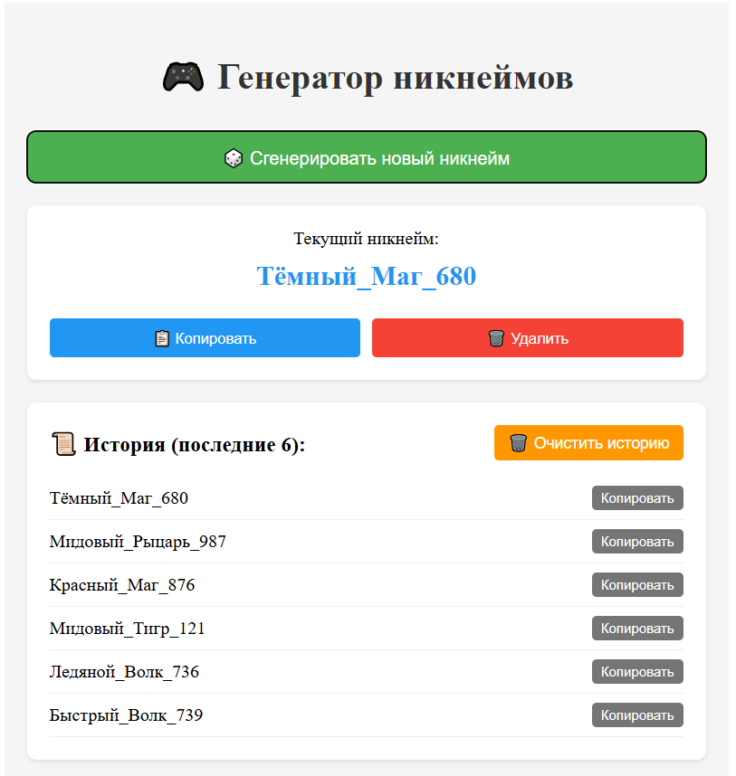

Краткое описание
Генератор никнеймов - React-приложение для создания случайных уникальных имён. Оно генерирует ники по шаблону "Прилагательное_Существительное_Число", позволяет копировать их в буфер обмена, сохраняет историю последних 5 вариантов и имеет простой адаптивный интерфейс.

Основные возможности
- Генерация случайных никнеймов по шаблону "Прилагательное_Существительное_Число"  
- Копирование любого ника в буфер обмена одним кликом
- Сохранение истории последних 5 сгенерированных вариантов
- Удаление текущего никнейма и очистка истории
- Адаптивный интерфейс, работающий на мобильных устройствах и ПК

Особенности реализации
- Построено на React с использованием функциональных компонентов и хуков (useState)
- Вся логика сосредоточена в одном компоненте App.js для простоты
- Использует нативный Clipboard API браузера для копирования текста
- Применён условный рендеринг для отображения истории только при наличии данных
- Стили вынесены в отдельный файл App.css с адаптивным дизайном

Выводы по выполненной работе
Успешно разработано рабочее React-приложение, демонстрирующее ключевые концепции: управление состоянием, обработку событий и компонентный подход. Проект имеет практическую ценность, готов к использованию и может быть легко расширен дополнительным функционалом.
